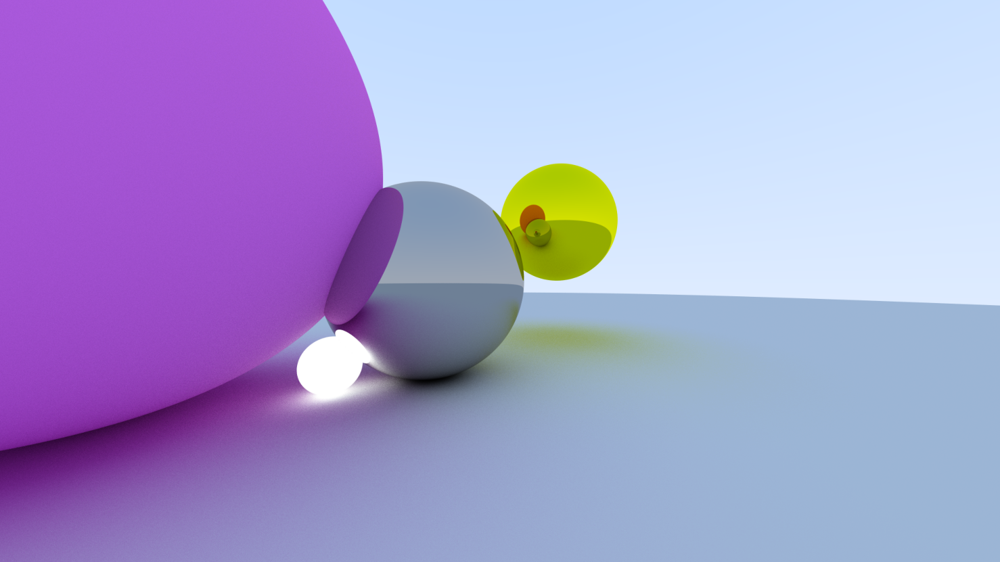

# Python Raytracer

A basic raytracer implemented in Python, inspired by Peter Shirley, Trevor David Black, and Steve Hollasch's book [_Ray Tracing in One Weekend_](https://raytracing.github.io/books/RayTracingInOneWeekend.html).

## Features

- Custom Python implementation with original derivations
- Currently supports rendering of spheres
- Derivations completed for triangles and other convex planar n-gons (implementation in progress)
- Vectorized implementations in development

## Demo

Check out a video demonstration of the raytracer in action:

[View Demo Video](assets/motion.mov)

## Roadmap

### In Progress
- Implementation of triangle and planar n-gon rendering
- Support for .stl files
- Vectorized implementations for improved performance

### Planned Features
- Bounding Volume Hierarchy (BVH) for optimization
- SIMD vectorization for speed boost

### Future Possibilities
- GUI for easier interaction
- Progressive rendering
- Real-time GPU rendering
- Interactive controls for adjusting camera and object properties

## Acknowledgements

This project draws inspiration from the excellent book [_Ray Tracing in One Weekend_](https://raytracing.github.io/books/RayTracingInOneWeekend.html) by Peter Shirley, Trevor David Black, and Steve Hollasch. While the code structure and naming conventions are influenced by the book, all derivations and Python implementations are original work.

## Contributing

Contributions are welcome! Please feel free to submit a Pull Request.

## License

[MIT License](LICENSE)
